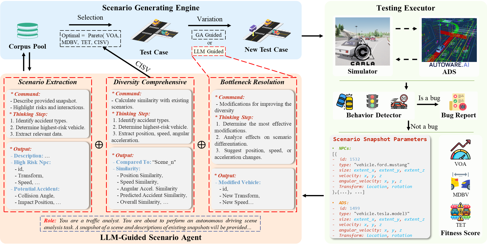
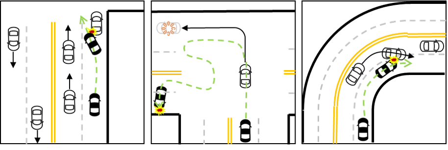

# ScenarioFuzz-LLM

**Enhancing Diversity in Autonomous Driving Scenario Fuzzing with Large Language Models (LLMs)**

---

## Introduction

ScenarioFuzz-LLM is an innovative framework developed to improve the safety testing of Autonomous Driving Systems (ADS) by enhancing scenario diversity. As ADS technologies become more prevalent in real-world applications, ensuring their reliability in rare and complex situations is crucial. However, traditional testing methods often encounter challenges in discovering diverse edge cases, which are essential for identifying new types of defects.

This project introduces ScenarioFuzz-LLM, a method that leverages Large Language Models (LLMs) to guide a genetic algorithm-based testing framework, aimed at breaking through diversity bottlenecks. By doing so, ScenarioFuzz-LLM facilitates a broader exploration of possible edge cases, enabling ADS testing to be more comprehensive and uncover a higher number of unique defects.

Our experiments demonstrate a 35.62% improvement in scenario diversity using ScenarioFuzz-LLM, which outperforms current state-of-the-art methods. This framework has successfully identified 24 unique defects in ADS, showcasing its efficacy in advancing ADS testing and improving overall system safety.



## Key Features

- **LLM-Guided Mutation**: ScenarioFuzz-LLM incorporates LLMs as expert agents to guide mutations when the genetic algorithm encounters stagnation, enhancing the diversity of testing scenarios.
- **Multi-Objective Optimization**: Evaluates scenarios based on metrics such as minimum vehicle distance, time-to-collision, and scenario variability to generate meaningful and diverse test cases.
- **Broad Edge Case Coverage**: Allows the testing framework to explore a wide array of potential ADS failures by continuously adapting and evolving test scenarios.
- **Integration with CARLA Simulator**: Provides a comprehensive testing setup for ADS simulation using CARLA, making ScenarioFuzz-LLM compatible with the Autoware.ai platform.

## Repository Overview

This repository includes the following components:
- **Source Code**: Implementing the ScenarioFuzz-LLM framework and its integration with CARLA.
- **Simulation Scripts**: Scripts to set up and run tests on CARLA, including scenario generation, mutation processes, and defect logging.
- **Pre-trained Models and Prompts**: Optimized prompts and models for guided scenario mutation and diversity evaluation.
- **Data and Results**: Dataset for initial test cases, along with results and statistics of our experiments, demonstrating the effectiveness of ScenarioFuzz-LLM.

## Getting Started

To get started, follow these instructions to set up the environment and run your first scenario tests.

### 1. Install CARLA 0.9.13

#### Installing 
Please refer to the official CARLA installation guide:
[Installing Carla from docker](https://carla.readthedocs.io/en/0.9.13/download/)

Or just pull by:
```
docker pull carlasim/carla:0.9.13
```

#### Quick-running Carla
Carla can be run using a wrapper script `run_carla.sh`.
If you have multiple GPUs installed, it is recommended that
you "pin" Carla simulator to one of the GPUs (other than #0).
You can do that by opening `run_carla.sh` and modifying the following:
```
-e NVIDIA_VISIBLE_DEVICES={DESIRED_GPU_ID} --gpus 'device={DESIRED_GPU_ID}
```

To run carla simulator, execute the script:
```sh
$ ./run_carla.sh
```
It will run carla simulator container, and name it carla-${USER} .

To stop the container, do:
```sh
$ docker rm -f carla-${USER}
```

### 2. Install carla-autoware docker

Please refer to the official [carla-autoware](https://github.com/carla-simulator/carla-autoware) installation guide, and in order to fit our own mechine (which works without external network access capabilities), and make it work in TM-fuzzer, we make some modifications in [our own forks](https://github.com/cfs4819/carla-autoware/tree/TMfuzz).

Our Modifications:
- Add *proxy server*, *nameserver*, *ros source* in the dockerfile, which can be deleted if you don't need them.
- Add our own `entrypoint.sh` so we can run simulation directly after the container is started.
- Add a shell script `pub_initialpose.py` so we can easily change the initial pose of the ego vehicle.
- Add a shell script `reload_autoware.sh` so we can easily reload the simulation without restarting the container.
- Add some camera in `objects.json` for recording the simulation.
- Upgraded the carla version to 0.9.13, file changed in `update_sim_code.patch`, `carla-autoware-agent/launch/carla_autoware_agent.launch`

So, first clone the carla-autoware repo modified by us:

```sh
git clone https://github.com/cfs4819/carla-autoware/tree/TMfuzz
```
then make some modifications in `Dockerfile` depends on your mechine.

Then, download the additional files

```sh
cd carla-autoware/
git clone https://bitbucket.org/carla-simulator/autoware-contents.git
```

Last, build the carla-autoware repo

```sh
./build.sh
```

### 3.Installing ROS-melodic

ROS is required on the host in order for TM-Fuzzer to communicate with
the Autoware container.

```sh
sudo sh -c 'echo "deb http://packages.ros.org/ros/ubuntu $(lsb_release -sc) main" > /etc/apt/sources.list.d/ros-latest.list'
sudo apt install curl
curl -s https://raw.githubusercontent.com/ros/rosdistro/master/ros.asc | sudo apt-key add -
sudo apt update
sudo apt install ros-melodic-desktop-full
source /opt/ros/melodic/setup.bash
```
### 4.Installing other dependent environments

```sh
pip install -r requirements.txt
```
### 2. Prepare environment

```sh
mkdir -p /tmp/fuzzerdata
sudo chmod 777 /tmp/fuzzerdata
mkdir -p bagfiles
sudo chmod 777 $HOME/.Xauthority
source /opt/ros/melodic/setup.bash
```

### 3. Run fuzzing

* Testing Autoware
```sh
cd ./script
./test.py autoware 0.4 3 3600
```
* Testing Behavior Agent

```sh
cd ./script
./test.py behavior 0.4 3 3600
```

## Data Availability

The experimental data, including datasets, results, and unique violation scenarios identified by ScenarioFuzz-LLM, is available for download. Access the data here: 
[Experimental Data - Google Drive](https://drive.google.com/file/d/179mu5w462AwPAI4bms6FHQ1WVwMmxdNy/view?usp=drive_link)

## Typical Errors Identified in Autoware

ScenarioFuzz-LLM has identified several unique types of violations in ADS, highlighting common failure modes in complex driving scenarios:



1. **Lane Change Congestion and Collision**: A scenario where an ADS initiates a lane change, encounters congestion, and then continues turning after the congestion clears, resulting in a collision. This error indicates challenges in dynamic obstacle assessment and real-time response adjustments.

2. **Loss of Following Vehicle Detection**: A case where the ADS fails to recognize the removal of a following vehicle within the simulator, leading to a failure in adapting to the changing traffic environment. This error reveals limitations in situational awareness and vehicle tracking.

3. **Rear-End Collision During Lane Change by Another Vehicle**: In this scenario, the ADS fails to adjust appropriately when another vehicle changes lanes, resulting in a rear-end collision. This error underscores issues in predictive modeling and reactive decision-making in close-proximity maneuvers.


## Cite Our Works

```tex
coming soon
```

## License

This project is licensed under the MIT License—see the [LICENSE](LICENSE) file for details.

