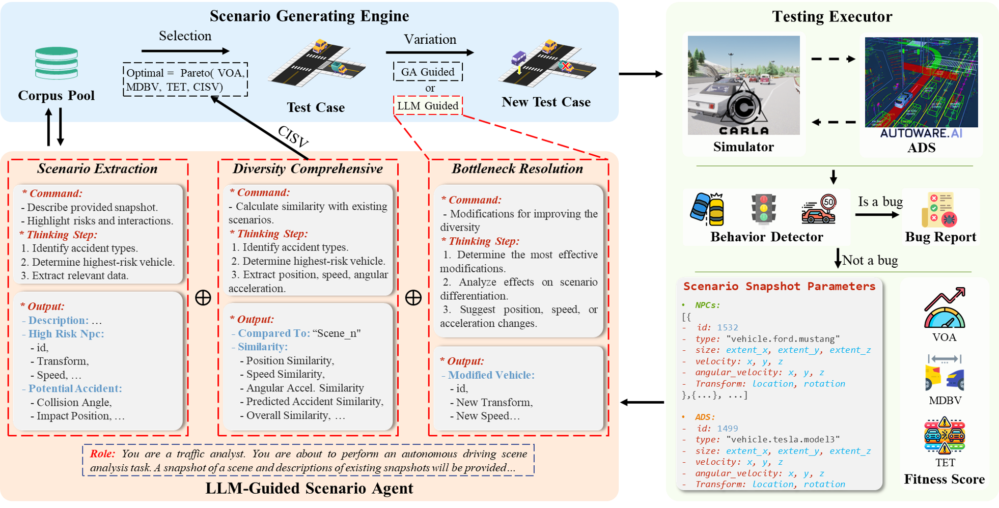
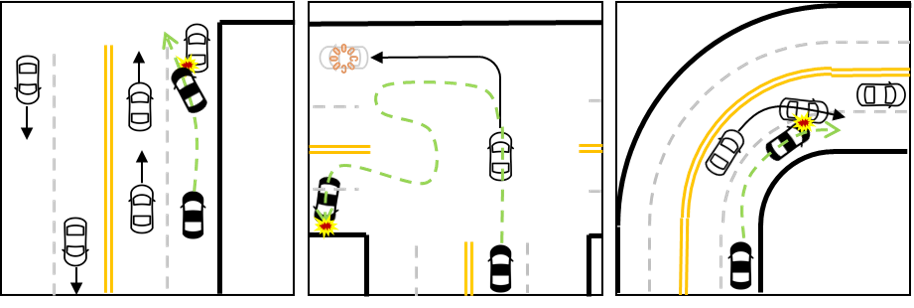

# ScenarioFuzz-LLM

**Enhancing Diversity in Autonomous Driving Scenario Fuzzing with Large Language Models (LLMs)**

---

## Introduction

ScenarioFuzz-LLM is an innovative framework developed to improve the safety testing of Autonomous Driving Systems (ADS) by enhancing scenario diversity. As ADS technologies become more prevalent in real-world applications, ensuring their reliability in rare and complex situations is crucial. However, traditional testing methods often encounter challenges in discovering diverse edge cases, which are essential for identifying new types of defects.

This project introduces ScenarioFuzz-LLM, a method that leverages Large Language Models (LLMs) to guide a genetic algorithm-based testing framework, aimed at breaking through diversity bottlenecks. By doing so, ScenarioFuzz-LLM facilitates a broader exploration of possible edge cases, enabling ADS testing to be more comprehensive and uncover a higher number of unique defects.

Our experiments demonstrate a 35.62% improvement in scenario diversity using ScenarioFuzz-LLM, which outperforms current state-of-the-art methods. This framework has successfully identified 24 unique defects in ADS, showcasing its efficacy in advancing ADS testing and improving overall system safety.



## Key Features

- **LLM-Guided Mutation**: ScenarioFuzz-LLM incorporates LLMs as expert agents to guide mutations when the genetic algorithm encounters stagnation, enhancing the diversity of testing scenarios.
- **RAG-Enhanced Generation**: New RAG (Retrieval-Augmented Generation) module provides semantic search and context-aware scenario generation for improved diversity.
- **Multi-Dimensional Evaluation**: Four new evaluation metrics (PC, PEC, TCD, BCM) provide comprehensive coverage assessment:
  - **PC (Parameter Coverage)**: Parameter space combination coverage
  - **PEC (Behavior Coverage)**: Physical behavior equivalence class coverage
  - **TCD (Trajectory Diversity)**: Trajectory pattern diversity using DTW and entropy
  - **BCM (Behavior Matrix)**: Behavior combination coverage
- **Multi-Objective Optimization**: Evaluates scenarios based on metrics such as minimum vehicle distance, time-to-collision, and scenario variability to generate meaningful and diverse test cases.
- **Broad Edge Case Coverage**: Allows the testing framework to explore a wide array of potential ADS failures by continuously adapting and evolving test scenarios.
- **Integration with CARLA Simulator**: Provides a comprehensive testing setup for ADS simulation using CARLA, making ScenarioFuzz-LLM compatible with the Autoware.ai platform.
- **Experiment Continuation**: Continue interrupted experiments seamlessly by resuming from checkpoints with full state recovery (GA population, archive, seed).
- **Enhanced Reproducibility**: Automatic seed saving and restoration ensures reproducible experiments across runs.
- **Robust Error Handling**: Improved error recovery mechanisms with automatic CARLA container restart and extended retry limits (1000 attempts, 7 days).

## Repository Overview

This repository includes the following components:
- **Core Fuzzing Engine**: The core GA-based scenario fuzzer and its CARLA integration (`fuzzer.py`, `scenario.py`, `states.py`, `config/`, `script/`).
- **RAG Module**: Retrieval-augmented generation for semantic-enhanced scenario generation (`rag_module/`).
- **Metrics Module**: Multi-dimensional evaluation metrics (PC, PEC, TCD, BCM) (`metrics/`).
- **Visualization Module**: Tools for generating charts and reports (`visualization/`).
- **Experiments Package**: Reproducible paper experiments (ScenarioFuzz-LLM, RAG-ScenarioFuzz, TM-Fuzzer), with runners, progress tracking, aggregation and analysis (`experiments/`; see `experiments/docs/PAPER_EXPERIMENTS.md` and `experiments/docs/QUICK_START.md`).
- **Pre-trained Models and Prompts**: Optimized prompts and models for guided scenario mutation and diversity evaluation.
- **Data and Results**: Dataset for initial test cases, along with results and statistics of our experiments, demonstrating the effectiveness of ScenarioFuzz-LLM.

## New Features

### RAG-Enhanced Scenario Generation

The framework now includes a RAG module that:
- Uses semantic search to retrieve relevant scenarios from a knowledge base
- Provides context-aware prompts for LLM-based scenario generation
- Improves scenario diversity through knowledge-guided mutations
For end-to-end experimental usage of RAG-ScenarioFuzz, see `experiments/docs/PAPER_EXPERIMENTS.md` or the quick commands in `experiments/docs/QUICK_START.md`.

### Multi-Dimensional Evaluation Metrics

Four new evaluation metrics provide comprehensive coverage assessment:
- **Parameter Coverage (PC)**: Measures parameter space combination coverage
- **Behavior Coverage (PEC)**: Evaluates physical behavior equivalence class coverage
- **Trajectory Diversity (TCD)**: Measures trajectory pattern diversity using DTW
- **Behavior Matrix Coverage (BCM)**: Evaluates behavior combination coverage

These metrics are automatically collected and aggregated in the new experiment pipeline (see `experiments/PAPER_EXPERIMENTS.md` for details).

### Experiment Continuation and Reproducibility

**Continue Interrupted Experiments**:
- Seamlessly resume experiments from checkpoints
- Automatically restore GA state (population, archive, hall of fame)
- Preserve random seed for reproducibility
- Generate additional scenarios without losing progress

**Usage Example**:
```bash
# Continue an existing experiment
python -m experiments.runners.run_scenariofuzz_llm \
  --continue-experiment ScenarioFuzz-LLM_20251203_210023 \
  --continue-scenarios 50 \
  --output-root ./experiment_results
```

**Enhanced Reproducibility**:
- Random seeds are automatically saved to checkpoints
- Seeds are restored when continuing experiments
- Ensures reproducible scenario generation across runs
- See `REPRODUCIBILITY_ANALYSIS.md` for detailed analysis

**Robust Error Handling**:
- Automatic CARLA container restart on connection failures
- Extended retry limits (1000 attempts, 7 days duration)
- Graceful handling of individual scenario failures
- Checkpoint recovery even if checkpoint file is corrupted

For detailed usage instructions, see:
- `CONTINUE_EXPERIMENT_GUIDE.md` - Complete guide for continuing experiments
- `REPRODUCIBILITY_ANALYSIS.md` - Reproducibility analysis and best practices
- `FIXES_MAX_SCENARIOS.md` - Technical details on improvements

## Getting Started

To get started, follow these instructions to set up the environment and run your first scenario tests.

### 1. Install CARLA 0.9.13

#### Installing 
Please refer to the official CARLA installation guide:
[Installing Carla from docker](https://carla.readthedocs.io/en/0.9.13/download/)

Or just pull by:
```
docker pull carlasim/carla:0.9.13
```

#### Quick-running Carla
Carla can be run using a wrapper script `run_carla.sh`.
If you have multiple GPUs installed, it is recommended that
you "pin" Carla simulator to one of the GPUs (other than #0).
You can do that by opening `run_carla.sh` and modifying the following:
```
-e NVIDIA_VISIBLE_DEVICES={DESIRED_GPU_ID} --gpus 'device={DESIRED_GPU_ID}
```

To run carla simulator, execute the script:
```sh
$ ./run_carla.sh
```
It will run carla simulator container, and name it carla-${USER} .

To stop the container, do:
```sh
$ docker rm -f carla-${USER}
```

### 2. Install carla-autoware docker

Please refer to the official [carla-autoware](https://github.com/carla-simulator/carla-autoware) installation guide, and in order to fit our own mechine (which works without external network access capabilities), and make it work in TM-fuzzer, we make some modifications in [our own forks](https://github.com/cfs4819/carla-autoware/tree/TMfuzz).

Our Modifications:
- Add *proxy server*, *nameserver*, *ros source* in the dockerfile, which can be deleted if you don't need them.
- Add our own `entrypoint.sh` so we can run simulation directly after the container is started.
- Add a shell script `pub_initialpose.py` so we can easily change the initial pose of the ego vehicle.
- Add a shell script `reload_autoware.sh` so we can easily reload the simulation without restarting the container.
- Add some camera in `objects.json` for recording the simulation.
- Upgraded the carla version to 0.9.13, file changed in `update_sim_code.patch`, `carla-autoware-agent/launch/carla_autoware_agent.launch`

So, first clone the carla-autoware repo modified by us:

```sh
git clone https://github.com/cfs4819/carla-autoware/tree/TMfuzz
```
then make some modifications in `Dockerfile` depends on your mechine.

Then, download the additional files

```sh
cd carla-autoware/
git clone https://bitbucket.org/carla-simulator/autoware-contents.git
```

Last, build the carla-autoware repo

```sh
./build.sh
```

### 3.Installing ROS-melodic

ROS is required on the host in order for TM-Fuzzer to communicate with
the Autoware container.

```sh
sudo sh -c 'echo "deb http://packages.ros.org/ros/ubuntu $(lsb_release -sc) main" > /etc/apt/sources.list.d/ros-latest.list'
sudo apt install curl
curl -s https://raw.githubusercontent.com/ros/rosdistro/master/ros.asc | sudo apt-key add -
sudo apt update
sudo apt install ros-melodic-desktop-full
source /opt/ros/melodic/setup.bash
```
### 4.Installing other dependent environments

```sh
pip install -r requirements.txt
```

### 5. (Recommended) Use a Python virtual environment and run tests

For development and testing it is recommended to use a virtual environment
to isolate Python dependencies:

```sh
cd /path/to/ScenarioFuzz-LLM

# Create virtual environment (only once)
python3 -m venv .venv

# Activate it (bash / zsh)
source .venv/bin/activate

# Install project dependencies
pip install -r requirements.txt

# Install test dependencies
pip install pytest

# Run unit tests for non-CARLA modules
pytest -q
```

### 2. Prepare environment

```sh
mkdir -p /tmp/fuzzerdata
sudo chmod 777 /tmp/fuzzerdata
mkdir -p bagfiles
sudo chmod 777 $HOME/.Xauthority
source /opt/ros/melodic/setup.bash
```

### 3. Run fuzzing (low-level TM-Fuzzer compatibility)

* Testing Autoware
```sh
cd ./script
./test.py autoware 0.4 3 3600
```
* Testing Behavior Agent

```sh
cd ./script
./test.py behavior 0.4 3 3600
```

## Reproducing Paper Experiments (Sections 3.3–3.5)

The recommended way to reproduce the experiments in the paper is to use the unified `experiments/` pipeline. It consists of three steps:

### 1. Run three methods (ScenarioFuzz-LLM / RAG-ScenarioFuzz / TM-Fuzzer)

From the project root, **always use the project virtual environment**:

```sh
cd /path/to/ScenarioFuzz-LLM
source venv/bin/activate        # or: source .venv/bin/activate

# ScenarioFuzz-LLM (behavior model, quantitative example)
python -m experiments.runners.run_scenariofuzz_llm \
  --num-scenarios 1000 \
  --output-root ./experiment_results

# Continue an existing experiment (generate 50 more scenarios)
python -m experiments.runners.run_scenariofuzz_llm \
  --continue-experiment ScenarioFuzz-LLM_20251203_210023 \
  --continue-scenarios 50 \
  --output-root ./experiment_results

# RAG-ScenarioFuzz (behavior model, quantitative example)
python -m experiments.runners.run_rag_scenariofuzz \
  --num-scenarios 1000 \
  --output-root ./experiment_results

# TM-Fuzzer baseline (Autoware target, quantitative example)
python -m experiments.runners.run_tmfuzzer \
  --num-scenarios 1000 \
  --target autoware \
  --output-root ./experiment_results
```

Each run creates a directory of the form:

- `./experiment_results/<MethodName>/<experiment_id>/...`

where `<MethodName>` is one of `ScenarioFuzz-LLM`, `RAG-ScenarioFuzz`, or `TM-Fuzzer`.

### 2. Aggregate metrics across all runs

After the three methods have been run (possibly multiple times), aggregate the per-run metrics:

```sh
python -m experiments.aggregation.main
```

This scans `./experiment_results` for `metrics_summary.json` files and produces:

- `./experiment_results/all_methods_results.json`

which contains all methods and runs in a single JSON structure.

### 3. Generate figures and reports

Finally, generate figures and human-readable reports:

```sh
# Figures (PC bar chart, multi-metric radar chart)
python -m experiments.analysis.generate_figures \
  --results-file ./experiment_results/all_methods_results.json \
  --output-dir ./reports/figs

# Markdown + JSON reports
python -m experiments.analysis.generate_reports \
  --results-file ./experiment_results/all_methods_results.json \
  --output-dir ./reports \
  --experiment-name Thesis_Experiment
```

You can also run both steps with a single command:

```sh
python -m experiments.analysis.main
```

For more detailed、step-by-step commands and troubleshooting tips, refer to:

- `experiments/docs/PAPER_EXPERIMENTS.md`
- `experiments/docs/QUICK_START.md`

## Similarity Scoring Method Comparison Experiment

This experiment compares four different similarity scoring methods to determine the best approach for measuring scenario diversity:

- **answer2**: LLM-based similarity scoring (current default method)
- **embedding**: Embedding-based semantic similarity using sentence transformers
- **feature**: Feature-based similarity using multi-dimensional features (position, speed, angular acceleration)
- **hybrid**: Hybrid similarity combining embedding and feature similarities

### Evaluation Metrics

The experiment evaluates each method using four diversity metrics:
- **PC (Parameter Coverage)**: Parameter space combination coverage
- **PEC (Behavior Coverage)**: Physical behavior equivalence class coverage
- **TCD (Trajectory Diversity)**: Trajectory pattern diversity using DTW and entropy
- **BCM (Behavior Matrix)**: Behavior combination coverage

### Running the Comparison Experiment

#### Option 1: Run All Methods Sequentially (Recommended)

Use the batch script to automatically run all four methods:

```bash
bash experiments/scripts/run_similarity_comparison.sh \
  --num-scenarios 1000 \
  --output-root ./experiment_results
```

This will run all four methods sequentially, each generating the specified number of scenarios.

#### Option 2: Run Individual Methods

Run a specific similarity method:

```bash
# LLM-based (answer2)
python -m experiments.runners.run_similarity_comparison \
  --num-scenarios 1000 \
  --similarity-method answer2 \
  --output-root ./experiment_results

# Embedding-based
python -m experiments.runners.run_similarity_comparison \
  --num-scenarios 1000 \
  --similarity-method embedding \
  --output-root ./experiment_results

# Feature-based
python -m experiments.runners.run_similarity_comparison \
  --num-scenarios 1000 \
  --similarity-method feature \
  --output-root ./experiment_results

# Hybrid
python -m experiments.runners.run_similarity_comparison \
  --num-scenarios 1000 \
  --similarity-method hybrid \
  --hybrid-embedding-weight 0.6 \
  --output-root ./experiment_results
```

#### Available Parameters

- `--num-scenarios`: Number of scenarios to generate (required)
- `--similarity-method`: Similarity scoring method (`answer2`, `embedding`, `feature`, `hybrid`)
- `--output-root`: Output root directory (default: `./experiment_results`)
- `--target`: Target ADS system (`behavior` or `autoware`, default: `behavior`)
- `--town`: CARLA town number (default: 3)
- `--timeout`: Scenario timeout in seconds (default: 60)
- `--rag-k`: Top-k for RAG retrieval (default: 5)
- `--hybrid-embedding-weight`: Weight for embedding in hybrid method (0.0-1.0, default: 0.6)
- `--feature-position-weight`: Weight for position similarity (default: 0.3)
- `--feature-speed-weight`: Weight for speed similarity (default: 0.3)
- `--feature-angular-accel-weight`: Weight for angular acceleration similarity (default: 0.2)
- `--feature-relative-position-weight`: Weight for relative position similarity (default: 0.2)

### Analyzing Comparison Results

After running all methods, analyze and compare the results:

```bash
python -m experiments.analysis.compare_similarity_methods \
  --results-dir ./experiment_results/SimilarityComparison \
  --output-dir ./reports/similarity_comparison
```

This will generate:
- **comparison_report.json**: Detailed metrics comparison in JSON format
- **comparison_report.md**: Human-readable comparison report with tables
- **comparison_figures/**: Visualization charts including:
  - Bar charts for each metric (PC, PEC, TCD, BCM)
  - Radar chart showing normalized comparison across all metrics

### Output Structure

```
experiment_results/
  SimilarityComparison/
    SimilarityComparison_answer2_YYYYMMDD_HHMMSS/
      metrics_summary.json
      ...
    SimilarityComparison_embedding_YYYYMMDD_HHMMSS/
      metrics_summary.json
      ...
    SimilarityComparison_feature_YYYYMMDD_HHMMSS/
      metrics_summary.json
      ...
    SimilarityComparison_hybrid_YYYYMMDD_HHMMSS/
      metrics_summary.json
      ...
```

### Key Features

- **Automatic RAG Initialization**: RAG is automatically enabled for all methods (required for embedding and hybrid methods)
- **Consistent Configuration**: All methods use the same experimental parameters for fair comparison
- **Comprehensive Metrics**: All four diversity metrics (PC, PEC, TCD, BCM) are automatically collected
- **Detailed Analysis**: Comparison reports include mean, std, min, max, and run count for each metric

## Data Availability

The experimental data, including datasets, results, and unique violation scenarios identified by ScenarioFuzz-LLM, is available for download. Access the data here: 
[Experimental Data - Google Drive](https://drive.google.com/file/d/179mu5w462AwPAI4bms6FHQ1WVwMmxdNy/view?usp=drive_link)

## Typical Errors Identified in Autoware

ScenarioFuzz-LLM has identified several unique types of violations in ADS, highlighting common failure modes in complex driving scenarios:



1. **Lane Change Congestion and Collision**: A scenario where an ADS initiates a lane change, encounters congestion, and then continues turning after the congestion clears, resulting in a collision. This error indicates challenges in dynamic obstacle assessment and real-time response adjustments.

2. **Loss of Following Vehicle Detection**: A case where the ADS fails to recognize the removal of a following vehicle within the simulator, leading to a failure in adapting to the changing traffic environment. This error reveals limitations in situational awareness and vehicle tracking.

3. **Rear-End Collision During Lane Change by Another Vehicle**: In this scenario, the ADS fails to adjust appropriately when another vehicle changes lanes, resulting in a rear-end collision. This error underscores issues in predictive modeling and reactive decision-making in close-proximity maneuvers.


## Cite Our Works

```tex
coming soon
```

## License

This project is licensed under the MIT License—see the [LICENSE](LICENSE) file for details.

